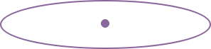

#niceripple



> niceripple is a nice material design ripple effect style library, no dependencies.

##usage

-  1st step

	Include `niceripple.min.js` and `niceripple.min.css` file in the document

```	
	<link rel="stylesheet" type="text/css" href="yourpath/nicleripple.min.css" />   
		
	<script src="yourpath/niceripple.min.js"></script>

```

-	2nd step
	
```
	<button class="niceripple" data-ripple-color="#" data-ripple-time="1000ms"></button>

```

- 3rd step

	Enjoy your niceripple
	


